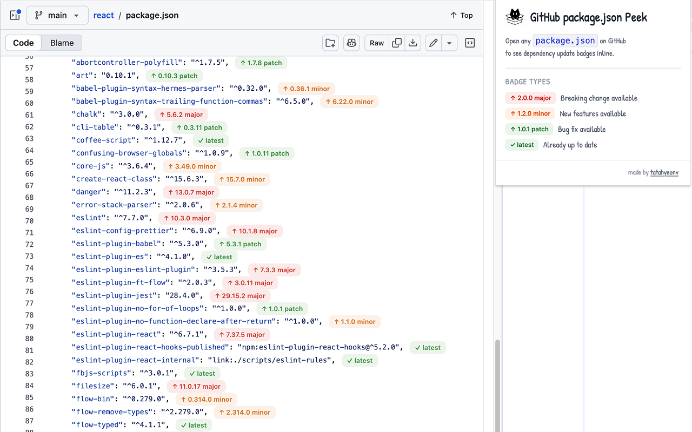

# GitHub package.json Peek

> See live npm version badges directly inside GitHub's `package.json` view — no extra tools, no copy-pasting.

## What it does

When you open a `package.json` file on GitHub, the extension automatically fetches the latest version of each dependency from npm and injects a colored badge next to every version string.

Browsing any repository on GitHub, you'll know at a glance which packages need updating.

## Badge types

| Badge | Color | Meaning |
|---|---|---|
| `↑ 2.0.0 major` | 🔴 Red | A breaking update is available |
| `↑ 1.2.0 minor` | 🟠 Orange | New features are available |
| `↑ 1.0.1 patch` | 🟢 Green | A bug-fix update is available |
| `✓ latest` | 🟢 Green | Already up to date |

## Installation

Install from the [Chrome Web Store](https://chromewebstore.google.com/detail/github-packagejson-peek/mkiiomdckffehnigieeflknajphjfghc?utm_source=item-share-cb)

## Usage

1. Navigate to any `package.json` file on GitHub
2. Badges appear automatically — no configuration needed

Both `dependencies` and `devDependencies` are supported.

## License

[MIT](LICENSE)